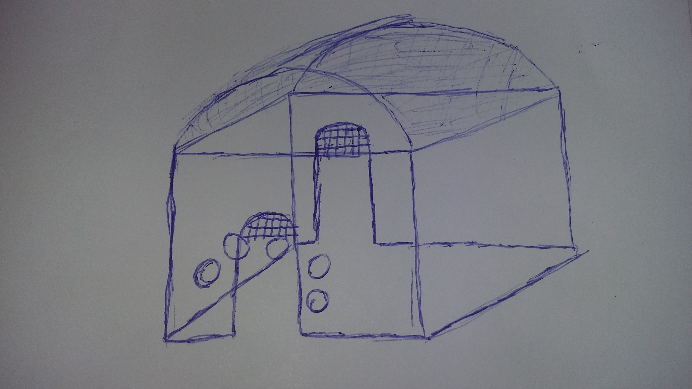
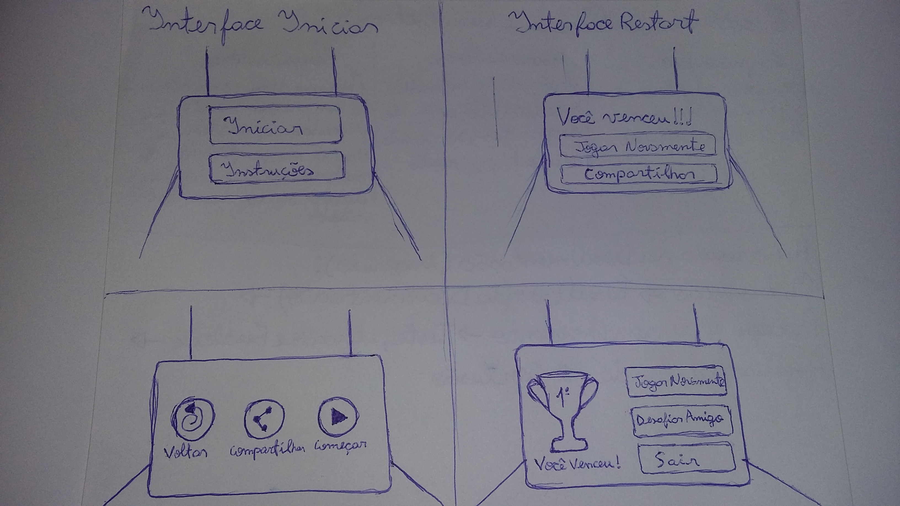
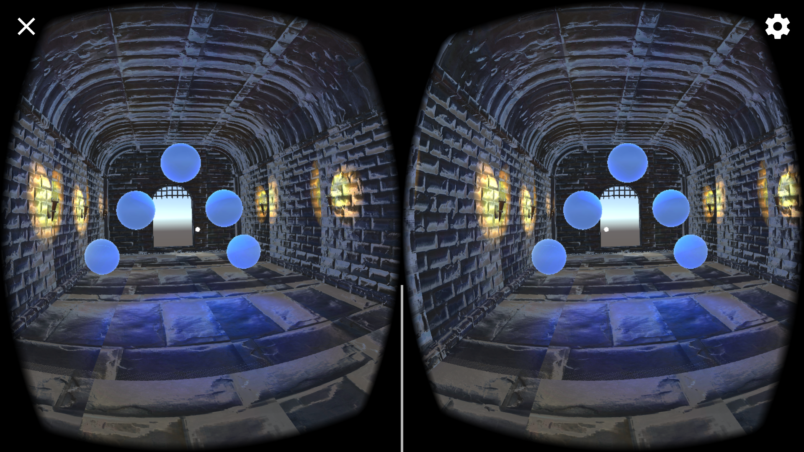
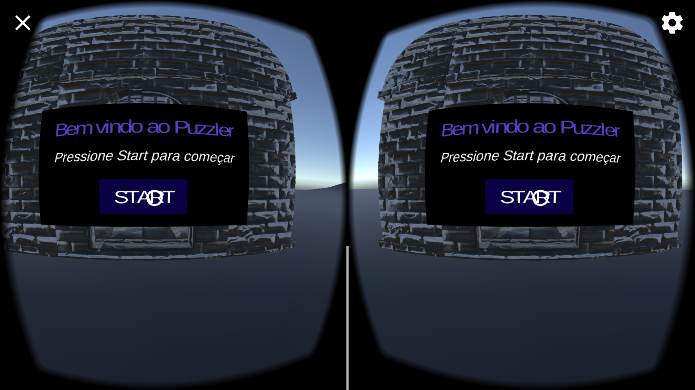
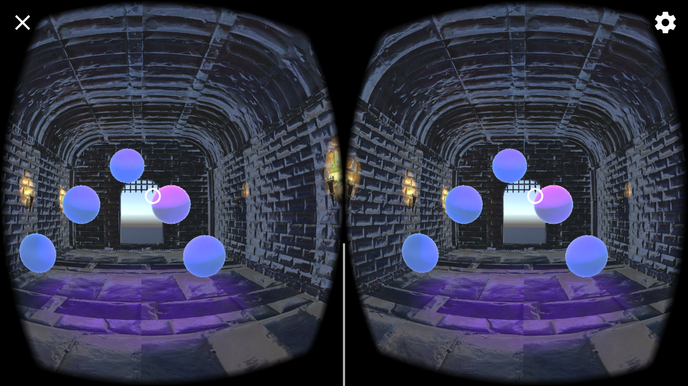
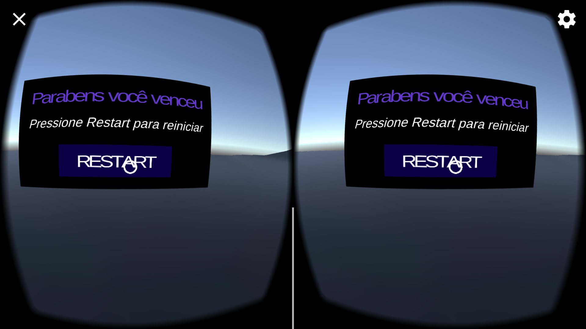

# Puzzler
Este projeto faz parte do programa Udacity VR Developer Nanodegree. A finalidade deste projeto foi aprensentar: a importancia da Documentação, fundamentos em design, interação do usuário e imerssão de ambiente usando sonorização e iluminação. 
Essa Documentação mostra detalhes de desenvolvimento e usabilidade.

### Propósito
Puzzler é um Game projetado para Realidade virtual com a finalidade de ajudar a quem está tendo suas primeiras experiencias em Realidade virtual, ensinando movimento, navegação, interação e feedbacks de maneira divertida, atravez de um desafio que testa a memoria do usuario ao decorar uma sequencia

## Processo

> **Rascunho Base para o ambiente do projeto (25/10/2018) :**
 
 

> **Rascunhos Base para a Interface Usuario, do projeto :**

 

> **Versão 1 do projeto (26/10/2018) :**

 

> **Versão 4 do projeto (Final 28/10/2018) :**

> Inicio
 

> Área de Jogo
 

> Fim 
 

## Testes, Iteração e Feedback

> **Teste 1 / Projeto Versão 1** -  Kathlen, 19 anos. Estudante (26/10/2018) :
>> *" O tamanho está bem parecido com o padrão, o ambiente tem um clima de suspense e tem um tom medieval. Vejo um balde de vinho, chão, tijolos e 5 bolas. Esse lugar me causou um pouco de tontura e dor de cabeça"*

> **Teste 2 / Projeto Versão Final** - Bruno, 20 anos. Guitarrista (28/10/2018) : 
>>*" O tamanho se parece com o mundo real, o clima gera um pouco de tensão e adrenalina. Vejo luzes que simula fogo e vejo 5 esferas flutuando em minha frente. Gostei da experiencia, só achei que a velocidade do deslocamento poderia ser um pouco mais rapida"* 

## Análise detalhadaa

O Jogo se inicia com o usuario a frente de uma UI que possibilita ele começar o game clicando em start. Ao entrar no castelo, o usuario terá de memorizar uma sequencia em que as esferas se ascendem. Apos isso se ele vencer poderá recomeçar a partida.
**Click na foto para assistir o video**

